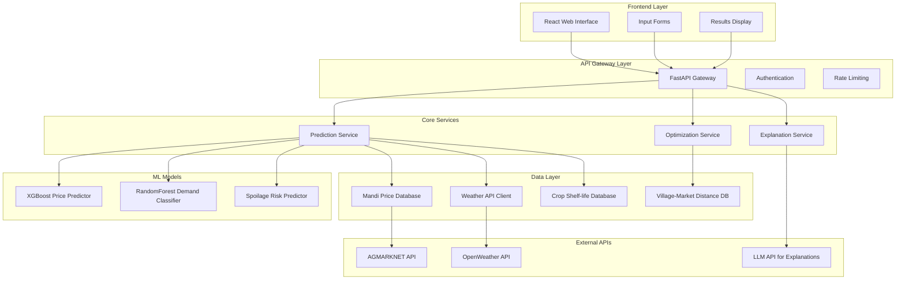

# Design Document

## Overview

The Rural Producer Intelligence Network (RPIN) is designed as a modular, AI-powered web application that provides intelligent market recommendations to rural producers. The system follows a microservices-inspired architecture with clear separation between data ingestion, ML prediction services, optimization logic, and user interface components.

The core architecture leverages FastAPI for high-performance REST APIs, pre-trained ML models for predictions, and a React-based frontend for user interaction. The system is designed to handle the constraints of rural internet connectivity while providing accurate, real-time market intelligence.

## Architecture

### System Architecture Diagram



### Technology Stack

- **Backend Framework**: FastAPI (Python 3.9+)
- **ML Framework**: XGBoost, scikit-learn, pandas
- **Frontend**: React with TypeScript
- **Data Storage**: SQLite for local data, JSON files for static data
- **Model Serialization**: Pickle files for trained models
- **API Documentation**: Automatic OpenAPI/Swagger via FastAPI
- **Deployment**: Docker containers for easy deployment

## Components and Interfaces

### 1. API Gateway Layer

**FastAPI Gateway Service**
- **Purpose**: Central entry point for all client requests
- **Responsibilities**: Request routing, authentication, rate limiting, response formatting
- **Key Endpoints**:
  - `POST /api/v1/predict` - Main prediction endpoint
  - `GET /api/v1/markets/{location}` - Get available markets for location
  - `GET /api/v1/crops` - Get supported crop types
  - `GET /api/v1/health` - Health check endpoint

**Interface Definition**:
```python
class PredictionRequest(BaseModel):
    village_location: str
    crop_type: str
    quantity_kg: float
    harvest_date: date

class PredictionResponse(BaseModel):
    markets: List[MarketRecommendation]
    best_market: str
    explanation: str
    confidence_score: float
```

### 2. Prediction Service

**Price Prediction Component**
- **Model**: XGBoost Regressor trained on historical mandi data
- **Input Features**: crop_type, market_id, date, seasonal_factors, historical_prices
- **Output**: 7-day price forecast with confidence intervals
- **Performance Target**: <2 seconds prediction time

**Demand Classification Component**
- **Model**: RandomForest Classifier based on price trend analysis
- **Input Features**: price_trends, seasonal_patterns, market_size, crop_type
- **Output**: Demand level (Low/Medium/High) with confidence score

**Spoilage Risk Predictor**
- **Model**: Linear regression with weather and crop-specific factors
- **Input Features**: temperature, humidity, transport_duration, crop_shelf_life
- **Output**: Spoilage percentage prediction

### 3. Optimization Service

**Profit Calculation Engine**
- **Algorithm**: Multi-objective optimization considering price, transport cost, spoilage risk
- **Formula**: `Net_Profit = (Predicted_Price × (1 - Spoilage_Risk) × Quantity) - Transport_Cost`
- **Constraints**: Maximum transport distance, minimum profit threshold
- **Output**: Ranked list of markets with expected profits

**Transport Cost Calculator**
- **Data Source**: Static village-to-market distance database
- **Calculation**: Distance-based pricing with vehicle type considerations
- **Rates**: ₹3-5 per km per quintal based on road conditions

### 4. Data Integration Layer

**AGMARKNET Data Client**
- **Source**: [data.gov.in AGMARKNET API](https://www.data.gov.in/resource/current-daily-price-various-commodities-various-markets-mandi)
- **Data Format**: JSON/CSV with daily price updates
- **Caching Strategy**: 24-hour cache with fallback to historical averages
- **Error Handling**: Graceful degradation with cached data

**Weather Data Integration**
- **Source**: OpenWeatherMap API for current and 7-day forecasts
- **Parameters**: Temperature, humidity, precipitation probability
- **Update Frequency**: Every 6 hours
- **Fallback**: Historical weather averages for the region

**Static Data Management**
- **Crop Database**: JSON file with shelf-life, handling requirements
- **Distance Matrix**: Pre-calculated distances between villages and markets
- **Market Information**: Market capacity, operating days, contact details

## Data Models

### Core Data Structures

```python
class Market(BaseModel):
    market_id: str
    name: str
    location: str
    coordinates: Tuple[float, float]
    operating_days: List[str]
    capacity_tons: float

class CropInfo(BaseModel):
    crop_id: str
    name: str
    shelf_life_days: int
    optimal_temperature: float
    humidity_tolerance: float
    handling_requirements: List[str]

class PriceData(BaseModel):
    market_id: str
    crop_id: str
    date: date
    min_price: float
    max_price: float
    modal_price: float
    arrivals_tons: float

class WeatherData(BaseModel):
    location: str
    date: date
    temperature_celsius: float
    humidity_percent: float
    precipitation_mm: float
    wind_speed_kmh: float

class MarketRecommendation(BaseModel):
    market_name: str
    predicted_price: float
    demand_level: str
    spoilage_risk_percent: float
    transport_cost: float
    net_profit: float
    confidence_score: float
    optimal_selling_day: date
```

### Database Schema

**SQLite Tables for Local Data**:
- `historical_prices`: Stores cached mandi price data
- `weather_cache`: Stores weather forecast data
- `user_sessions`: Tracks user interactions for analytics
- `prediction_logs`: Logs all predictions for model improvement

**JSON Configuration Files**:
- `crops.json`: Static crop information and shelf-life data
- `markets.json`: Market details and operating information
- `distances.json`: Village-to-market distance matrix
- `model_config.json`: ML model parameters and thresholds

Now I need to use the prework tool to analyze the acceptance criteria before writing the Correctness Properties section.
## Correctness Properties

*A property is a characteristic or behavior that should hold true across all valid executions of a system—essentially, a formal statement about what the system should do. Properties serve as the bridge between human-readable specifications and machine-verifiable correctness guarantees.*

### Property 1: Input Validation Consistency
*For any* user input (location, crop type, quantity, harvest date), the system should validate it according to the defined rules and provide appropriate feedback for invalid inputs, while accepting all valid inputs.
**Validates: Requirements 1.2, 1.3, 1.4, 1.5**

### Property 2: Prediction Generation Completeness  
*For any* valid producer input, the system should generate price forecasts for the next 7 days, demand classifications for all relevant markets, and ensure at least 3 nearby markets are analyzed.
**Validates: Requirements 2.1, 2.5, 3.1**

### Property 3: Spoilage Risk Calculation Consistency
*For any* transport scenario with crop type, weather conditions, and transport duration, the spoilage risk should be calculated as a valid percentage (0-100%) based on these factors.
**Validates: Requirements 4.1, 4.3**

### Property 4: Transport Cost Calculation Accuracy
*For any* village-to-market route, transport costs should be calculated using per-kilometer rates based on vehicle type and cargo weight, always selecting the most economical option when multiple options exist.
**Validates: Requirements 5.2, 5.3**

### Property 5: Profit Optimization Mathematical Correctness
*For any* complete prediction dataset, net profit should be calculated using the formula (Predicted_Price × Remaining_Quantity) - Transport_Cost, considering spoilage risk in the remaining quantity calculation.
**Validates: Requirements 6.1, 6.2**

### Property 6: Market Ranking and Highlighting Consistency
*For any* set of market recommendations, markets should be ranked by expected net profit in descending order, with the highest-profit market highlighted as the best choice.
**Validates: Requirements 6.4, 6.5, 7.5**

### Property 7: Results Display Structure Completeness
*For any* recommendation result, the comparison table should contain all required columns (market name, predicted price, demand level, spoilage risk, transport cost, net profit) with the recommended market visually emphasized.
**Validates: Requirements 7.1, 7.2**

### Property 8: Data Formatting Consistency
*For any* monetary value or percentage displayed in the system, formatting should follow Indian Rupee conventions with thousand separators for currency and clear percentage notation for risk and confidence values.
**Validates: Requirements 7.3, 7.4**

### Property 9: Explanation Generation Completeness
*For any* recommendation generated, the explanation should include key factors (price differences, spoilage risks, transport costs), be presented in appropriate language, and quantify financial impact when profit differences are significant.
**Validates: Requirements 8.1, 8.2, 8.3, 8.4, 8.5**

### Property 10: Data Access Reliability
*For any* valid crop or location query, the system should successfully retrieve shelf-life data from the crop database and distance data from the village-to-market database.
**Validates: Requirements 9.3, 9.4**

### Property 11: Performance and Caching Consistency
*For any* user request under normal conditions, the system should provide complete recommendations within 10 seconds and cache ML models in memory to avoid repeated loading delays.
**Validates: Requirements 10.1, 10.2**

### Property 12: Error Handling Consistency
*For any* error condition that occurs during system operation, user-friendly error messages should be provided with suggested alternative actions.
**Validates: Requirements 10.5**

## Error Handling

### Error Categories and Responses

**Input Validation Errors**
- Invalid location data: Return suggested valid locations from database
- Unsupported crop types: Return list of supported crops with similar names
- Invalid quantity values: Return format requirements and acceptable ranges
- Invalid harvest dates: Return acceptable date range (next 30 days)

**External API Failures**
- AGMARKNET API unavailable: Fall back to cached historical price data with staleness warning
- Weather API timeout: Use historical weather averages for the region and season
- LLM API failure: Provide template-based explanations with key numerical data

**Data Quality Issues**
- Insufficient historical data: Return predictions with wider confidence intervals
- Missing distance data: Calculate estimates using geographic coordinates
- Incomplete weather forecasts: Use partial data with uncertainty indicators

**System Performance Issues**
- High load conditions: Implement request queuing with estimated wait times
- Model loading failures: Retry with exponential backoff, fall back to simpler models
- Database connection issues: Use in-memory caches with periodic refresh attempts

### Graceful Degradation Strategy

The system implements a tiered degradation approach:

1. **Full Service**: All APIs available, complete predictions with high confidence
2. **Reduced Accuracy**: Some APIs unavailable, predictions with lower confidence and warnings
3. **Basic Service**: Cached data only, historical averages with clear staleness indicators
4. **Emergency Mode**: Core functionality only, simplified recommendations based on static rules

## Testing Strategy

### Dual Testing Approach

The RPIN system requires both unit testing and property-based testing to ensure comprehensive coverage:

**Unit Tests** focus on:
- Specific examples of input validation edge cases
- Integration points between ML models and data sources
- Error conditions and fallback scenarios
- API endpoint response formats and status codes

**Property Tests** focus on:
- Universal properties that hold across all inputs
- Mathematical correctness of profit calculations
- Consistency of data formatting and display rules
- Comprehensive input coverage through randomization

### Property-Based Testing Configuration

**Framework**: Hypothesis (Python) for property-based testing
**Configuration**: Minimum 100 iterations per property test
**Test Tagging**: Each property test references its design document property

Example test tags:
- **Feature: rural-producer-intelligence-network, Property 1: Input Validation Consistency**
- **Feature: rural-producer-intelligence-network, Property 5: Profit Optimization Mathematical Correctness**

### ML Model Testing Strategy

**Model Validation**:
- Cross-validation on historical mandi price data
- Backtesting on known market scenarios
- Performance benchmarking against simple baseline models
- Robustness testing with synthetic edge cases

**Data Pipeline Testing**:
- Round-trip testing for data serialization/deserialization
- Schema validation for external API responses
- Cache consistency verification
- Data freshness and staleness detection

### Integration Testing

**API Integration**:
- Mock external APIs for consistent testing
- Contract testing for AGMARKNET and weather API responses
- End-to-end workflow testing from input to recommendation
- Performance testing under various load conditions

**UI Integration**:
- Component testing for React form validation
- Visual regression testing for results display
- Accessibility testing for rural user scenarios
- Cross-browser compatibility testing

### Performance Testing

**Load Testing**:
- Concurrent user simulation for rural internet conditions
- API response time measurement under various loads
- Memory usage monitoring for ML model caching
- Database query performance optimization

**Stress Testing**:
- External API failure simulation
- High-volume prediction request handling
- Memory leak detection during extended operation
- Recovery testing after system failures