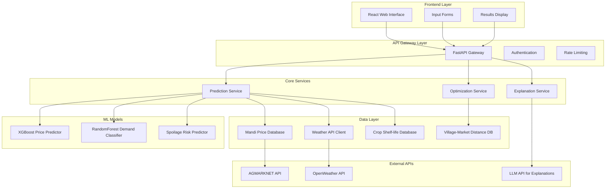
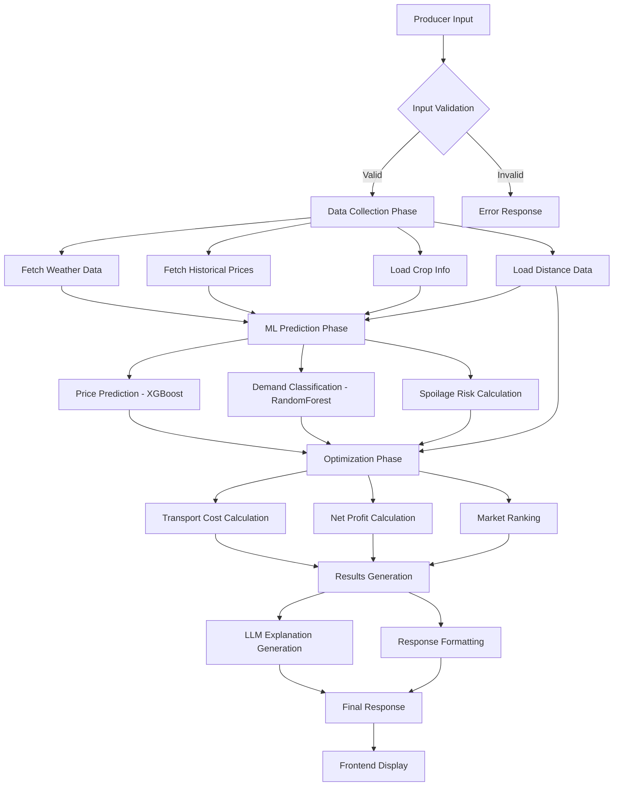
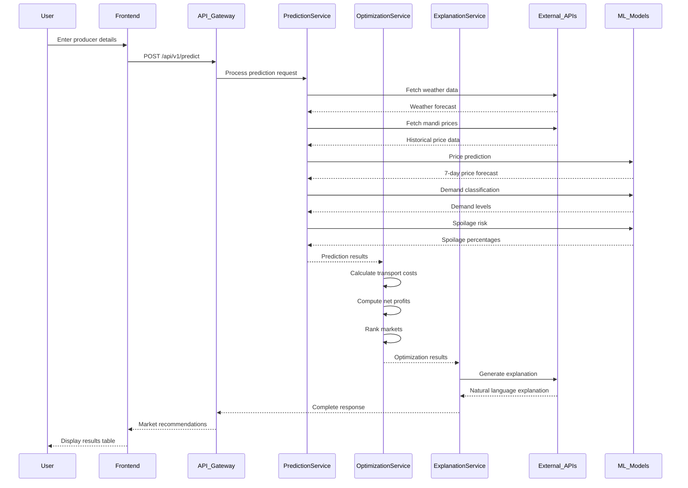
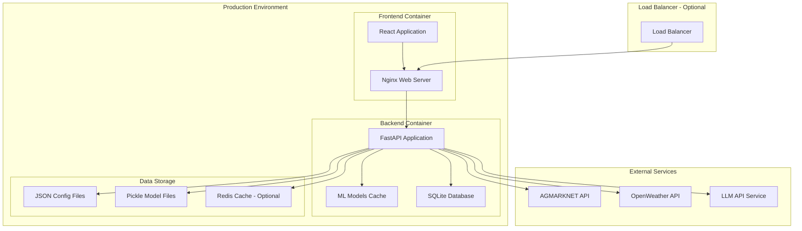
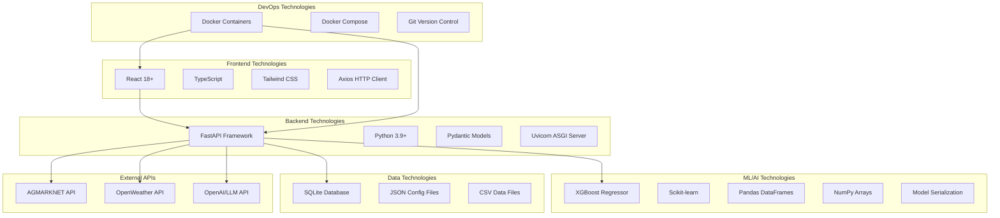
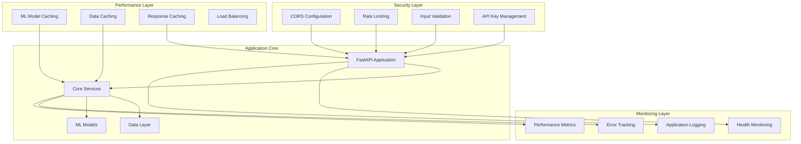

# RPIN System Architecture Diagrams

## High-Level System Architecture

## Data Flow Architecture

## Component Interaction Diagram

## Deployment Architecture

## Technology Stack Diagram

## Security and Performance Architecture

